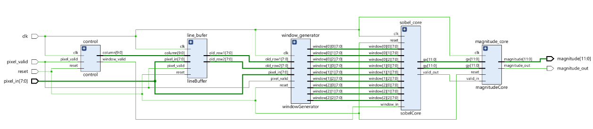
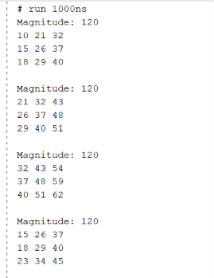
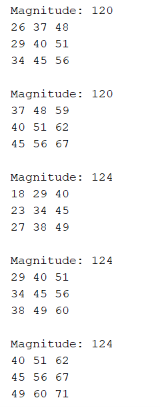
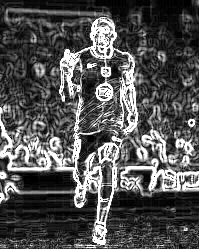
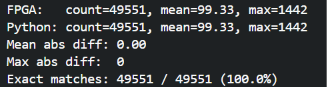

# FPGA Sobel Edge Detector

A streaming Sobel edge-detection written in SystemVerilog, verified bit-accurate against a Python reference model.

[Sobel edge-detection](https://en.wikipedia.org/wiki/Sobel_operator) is an image-processing technique that highlights the edges in an image by measuring how sharply brightness changes between neighboring pixels which is what turns a photo into the white-line outline you see in the demo below.

The design takes in an image one pixel per clock and processes it using a 3x3 sliding window. Instead of storing the whole image (which would be impractical in hardware), we use two line buffers to keep the previous two rows, and overwrite them as we move further down the image. 


## Demo

| Input Image | Sobel output |
|:---:|:---:|
|  |  |

## Key features

- 1 pixel per clock input
- Two line buffers instead of a full image buffer
- 3x3 sliding window using shift registers
- Parameterised image width
- Sobel `Gx` and `Gy` calculations
- `|Gx| + |Gy|` gradient magnitude
- Python reference model for verification
- Tested using a real image through the full RTL simulation

## How it works

The image is streamed into the design one pixel at a time

The line buffers store the previous two rows. For each new pixel, the design gets the pixels from the same column in those two rows. Those three pixels are then passed through three shift registers to build the current 3x3 window.

Once the window is valid, it is passed to the `SobelCore` module

The `control` module keeps track of the current row and column and generates `window_valid` to tell `SobelCore` when a complete 3x3 window is available




## How Sobel works

The design uses the standard Sobel kernels:

```
       -1  0  +1              +1  +2  +1
Gx =   -2  0  +2       Gy =    0   0   0
       -1  0  +1              -1  -2  -1
```

For each 3x3 window, the hardware calculates `Gx` and `Gy`

The output magnitude is calculated as 

magnitude = `|Gx| + |Gy|`

This is an approximation of the actual magnitude, `sqrt(Gx^2 + Gy^2)`, and avoids the need for square root in hardware.


## RTL design (`rtl/`)

| Module | Responsibility |
|--------|----------------|
| `sobelTop` | Top module which connects all the other modules together |
| `lineBuffer` | Stores previous two image rows |
| `shiftRegister` | 3-pixel register used to build each row of the 3x3 window |
| `windowGenerator` | Combines the three shift registers into the 3x3 window. |
| `control` | Tracks current row and column and generates window_valid |
| `sobelCore` | Calculates the Gx and Gy values |
| `magnitudeCore` | Calculates magnitude of Gx and Gy and generates magnitude_out |

## Verification

The RTL was tested using four SystemVerilog testbenches:

| Testbench | Purpose | Result |
| ------------------ | ----------------------------------------------- | -------- |
| `magnitudeCore_tb.sv` | Tests the magnitude calculation using known `Gx` and `Gy` values | PASS |
| `sobelCore_tb.sv` | Tests the Sobel `Gx` and `Gy` calculations using a known 3x3 window | PASS |
| `sobel_tb.sv` | Tests the complete Sobel datapath using a small 5x5 test image | PASS |
| `sobel_image_tb.sv` | Streams the full 201 x 251 image through the design and generates `output.txt` | N/A |


The first two testbenches use known input values and expected results to check the individual arithmetic modules.

The sobel_tb.sv testbench checks the complete datapath using a small 5x5 image, while sobel_image_tb.sv is used to run the full image through the design and generate the output for reconstruction in Python.

sobel_image_tb.sv outputs a .txt file, which Python uses to compare against the reference model pixel by pixel and to export the result as an image.

### Testbench Result - sobel_tb.sv

The 5x5 test produces 9 valid 3x3 windows. The resulting magnitudes can be seen below:

<table>
  <tr>
    <td></td>
    <td></td>
  </tr>
</table>

This test checks that the line buffers, shift registers, window generation and Sobel calculation work together correctly.


## Results

The current test image is resized to:

```text
Input:   201 x 251
Output:  199 x 249
```

The output is smaller because the design only produces an output when a complete 3x3 window is available, so the outer one-pixel border is dropped.

### FPGA implementation results

The design was implemented for the Xilinx Artix-7 `xc7a100tcsg324-1`.

| Resource | Usage |
| -------- | ----: |
| LUTs     | 3,427 |
| FFs      | 9,774 |
| BRAM     |     0 |
| DSPs     |     0 |

Post-route timing analysis gave a worst-case setup slack of **0.246 ns** with a 10 ns clock period.

This corresponds to an estimated maximum clock frequency of approximately **102.5 MHz**.

The design therefore **meets timing at 100 MHz** on the target Artix-7 device.

The input interface accepts 1 pixel per clock, giving a theoretical input rate of **100 million pixels/second at 100 MHz**, assuming a continuous stream of valid pixels.


## Python reference vs FPGA output

I streamed the full test image through the RTL simulation, and ran the same image through the Python model separately.

The RTL's magnitude output was captured and reconstructed into a PNG using Python code (inside the ./fpga_io folder) for comparison. The two outputs match, confirming the hardware datapath produces results consistent with the software reference.

| Python reference | FPGA output |
|:---:|:---:|
|  |  |

### Pixel-by-pixel comparison (`test/compare_raw.py`)

To verify the match numerically rather than by eye, I wrote test/compare_raw.py, which compares the RTL and Python outputs pixel-by-pixel. The full test image was streamed through the RTL simulation and also run through the Python model on its own. All 49,551 pixels matched exactly (100% match, mean absolute difference of 0), confirming the hardware datapath is bit-accurate against the reference model.



## How to run it

Install the Python dependencies:

```bash
pip install -r requirements.txt
```

### 1. Run the Python model

```bash
python python_model/main.py
```

This generates the software reference output.

### 2. Convert an image to pixels

```bash
python fpga_io/stream_image.py
```

This converts the input image into `fpga_io/pixels.txt`, with one pixel value per line.

### 3. Run the RTL simulation

Open the Vivado project and add all the design and test files.

The testbench reads `pixels.txt` and streams the pixels into `sobelTop`.

Make sure the simulation runs for at least 600 µs (increase appropriately if you're uploading your own image). If it stops early, output.txt will be incomplete and the pixel comparison in step 5 will fail.

The magnitude values from the simulation are written to the output file.

### 4. Rebuild the output image

```bash
python fpga_io/display_image.py
```

This converts the RTL output back into a PNG.

N.B. The image dimensions used by the Python scripts and the testbench need to match.

### 5. Compare Pixel by Pixel

```bash
python test/compare_raw.py
```

This compares the raw pixel output of the python model vs the FPGA.


## Limitations / future work

The current version is simulation-only. Some things I'd like to add are:

- Deploy the design to an FPGA board
- Connect the design to a camera or HDMI input
- Pipeline the Sobel arithmetic further to improve maximum clock frequency
- Add automatic RTL-vs-Python output checking in the testbench

